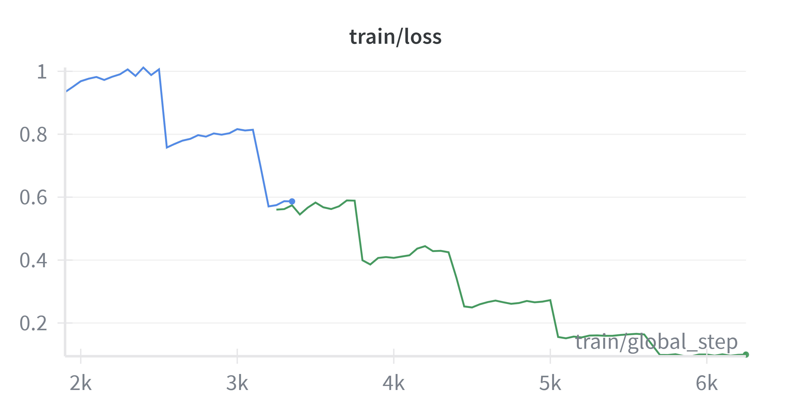

# 🧬 Fine-Tuned Medical Reasoning Model (DeepSeek-R1-Distill-Llama-8B)

This project demonstrates the fine-tuning of the **DeepSeek-R1-Distill-Llama-8B** model using **Unsloth** for **medical question answering and reasoning**.  
The goal is to enhance the model’s **clinical reasoning**, **diagnostic interpretation**, and **chain-of-thought (CoT)** capabilities on complex medical cases.

---

## 🧠 Project Overview

This fine-tuned model is designed to:
- Understand **clinical case questions**
- Generate **step-by-step reasoning** (Chain of Thought)
- Produce **accurate diagnostic and pathophysiological explanations**

It was trained using the **FreedomIntelligence/medical-o1-reasoning-SFT** dataset and optimized through **LoRA fine-tuning** (Low-Rank Adaptation) on **DeepSeek-R1-Distill-Llama-8B** via **Unsloth**.

---

## ⚙️ Model Details

| Parameter | Value |
|------------|--------|
| **Base Model** | DeepSeek-R1-Distill-Llama-8B |
| **Fine-tuning Framework** | [Unsloth](https://github.com/unslothai/unsloth) |
| **Technique** | LoRA (Low-Rank Adaptation) |
| **Precision** | 4-bit quantization |
| **Dataset** | [FreedomIntelligence/medical-o1-reasoning-SFT](https://huggingface.co/datasets/FreedomIntelligence/medical-o1-reasoning-SFT) |
| **Training Examples** | 5,000 |
| **Epochs** | 10 |
| **Hardware** | Google Colab (A100 GPU) |
| **Tracked With** | Weights & Biases (wandb) |

---

## 🤗 Pretrained Model

You can directly download and use the fine-tuned model from Hugging Face:

🔗 **[ali8461/fine-tuned-medical-model_5000_rows_10_epochs](https://huggingface.co/ali8461/fine-tuned-medical-model_5000_rows_10_epochs)**

### Example — Load the Fine-Tuned Model

```python
from unsloth import FastLanguageModel
from transformers import AutoTokenizer
import torch

# Load model and tokenizer
model_name = "ali8461/fine-tuned-medical-model_5000_rows_10_epochs"
model, tokenizer = FastLanguageModel.from_pretrained(model_name, load_in_4bit=True)

# Prompt style
prompt = """Below is a medical question. Think step-by-step before answering.

### Question:
A 35-year-old man presents with chest pain radiating to the left arm and elevated troponin levels. What is the most likely diagnosis?

### Response:
<think>"""

# Generate reasoning and answer
inputs = tokenizer([prompt], return_tensors="pt").to("cuda")
outputs = model.generate(input_ids=inputs.input_ids, max_new_tokens=500)
print(tokenizer.decode(outputs[0], skip_special_tokens=True))
````

---

## 📊 Training and Learning Curves

The model was trained for **10 epochs** with continuous monitoring via **Weights & Biases (wandb)**.

### 🧩 Learning Curve

*(Replace this with your actual plot image)*



> Example: Training loss vs. steps showing convergence during LoRA fine-tuning.

---

## 🧪 Test Results

Below are sample test cases illustrating the model’s reasoning ability after fine-tuning.

---

### 🩺 **Case 1**

**Question:**
A 26-year-old breastfeeding woman presents with redness, pain around the nipple, and purulent discharge, with a culture showing *Staphylococcus aureus*. Describe a typical occurrence pattern of this condition during the breastfeeding period.

**Response:**
The condition described is **mastitis**, which often occurs during the **early postpartum period**, particularly when milk production increases and the breasts are undergoing significant changes.
Mastitis is characterized by inflammation of breast tissue with **redness, pain, and purulent discharge**, commonly caused by *Staphylococcus aureus*.

This condition is frequent among breastfeeding mothers due to **blocked milk ducts** or **nipple injury**, allowing bacterial entry into breast tissue. Early recognition and treatment are essential to prevent complications.
Management includes **rest, warm compresses, antibiotics**, and continued breastfeeding as tolerated.

---

### 🩺 **Case 2**

**Question:**
A 59-year-old man presents with a fever, chills, night sweats, and generalized fatigue, and is found to have a 12 mm vegetation on the aortic valve. Blood cultures indicate gram-positive, catalase-negative, gamma-hemolytic cocci in chains that do not grow in a 6.5% NaCl medium.
What is the most likely predisposing factor for this patient's condition?

**Response:**
The findings indicate **infective endocarditis** caused by *Streptococcus gallolyticus* (formerly *S. bovis*).
The **most likely predisposing factor** is a **gastrointestinal lesion or trauma**, particularly **colonic neoplasia** or **mucosal injury**, which allows bacterial translocation into the bloodstream.
This association highlights the importance of **colonoscopy screening** in patients with *S. gallolyticus* endocarditis.

---

## 🖼️ Visualization Results


`results/learning_curve.png`

---

## 📁 Repository Structure

```
├── results/
│   ├── learning_curve.png
│   ├── example_generation.png
├── README.md
```

> Note: The **training code and dataset** are not uploaded, but full details and model link are provided above.

---

## 🧰 Dependencies (used in Colab)

| Library         | Version              |
| --------------- | -------------------- |
| Python          | ≥3.9                 |
| PyTorch         | ≥2.3.0               |
| Unsloth         | Latest (from GitHub) |
| Transformers    | ≥4.44.0              |
| Datasets        | ≥2.20.0              |
| TRL             | ≥0.9.0               |
| huggingface_hub | ≥0.24.0              |
| wandb           | ≥0.17.0              |

---

## 👨‍⚕️ Author

**Ali** — AI and Data Engineer

* 🤗 [Hugging Face Profile](https://huggingface.co/ali8461)
* 💻 [GitHub Profile](https://github.com/ali8461)

---

## 🧾 License

This project is shared under the **MIT License**.
You are free to use and modify the model for research and educational purposes.

---

## 🌟 Acknowledgements

* [Unsloth](https://github.com/unslothai/unsloth) — Efficient fine-tuning of LLMs
* [FreedomIntelligence/medical-o1-reasoning-SFT](https://huggingface.co/datasets/FreedomIntelligence/medical-o1-reasoning-SFT) — Medical CoT dataset
* [DeepSeek AI](https://huggingface.co/deepseek-ai) — Base model provider
* [Hugging Face Hub](https://huggingface.co/) — Model hosting

---

> 🧠 *This project advances the integration of medical expertise and reasoning into large language models, supporting explainable clinical decision-making.*
